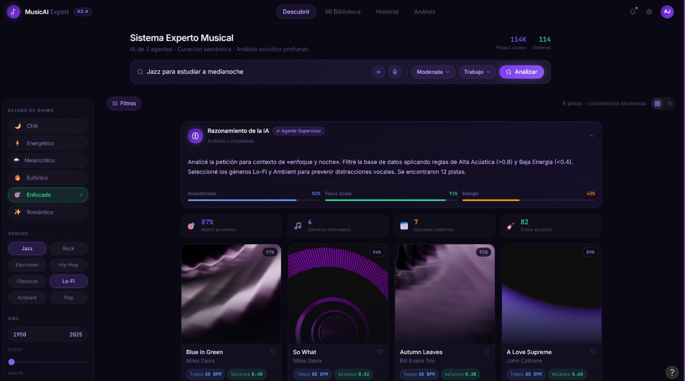

# Sistema Experto de Curaduría Musical Inteligente (AI Music Curator)

## Objetivo del Proyecto
Desarrollar un sistema experto moderno basado en agentes inteligentes capaz de interactuar con usuarios en lenguaje natural para realizar curaduría musical avanzada. El sistema no es un simple buscador, sino un motor de inferencia que traduce estados de ánimo, contextos y necesidades del usuario en parámetros acústicos precisos para recomendar música, automatizando el proceso de recomendación y explicando su razonamiento.

## Base de Conocimiento y Motor de Inferencia
El sistema se alimenta de una base de datos local (SQLite/PostgreSQL) procesada a partir de un dataset de Spotify con más de 114,000 canciones y 125 géneros diferentes. 

El motor de inferencia toma decisiones basándose en el análisis de las siguientes variables acústicas:
* **Valence:** Para inferir el estado de ánimo (canciones felices/eufóricas vs. tristes/melancólicas).
* **Energy & Tempo (BPM):** Para inferir el nivel de actividad (ej. listas para entrenar vs. listas para dormir).
* **Danceability:** Para inferir la idoneidad para eventos sociales o fiestas.
* **Acousticness & Instrumentalness:** Para inferir contextos de concentración (ej. música para estudiar o trabajar).

## Arquitectura de Agentes Inteligentes
El flujo de trabajo se divide en 3 agentes especializados:

### 1. Agente de Atención al Cliente (Analista de Intención)
* **Función:** Recibe el input en lenguaje natural del usuario.
* **Proceso:** Extrae las entidades clave (géneros musicales mencionados) y detecta la intención oculta o el contexto (ej. "estoy triste", "tengo una fiesta", "necesito concentrarme").
* **Salida:** Estructura los datos extraídos para el siguiente agente.

### 2. Agente Generador (Motor de Inferencia y Búsqueda)
* **Función:** Es el núcleo lógico del sistema.
* **Proceso:** Aplica reglas de producción (IF/THEN) para traducir el contexto del usuario en rangos numéricos. 
  * *Ejemplo:* `IF contexto == "relajación" THEN acousticness > 0.7 AND energy < 0.4`.
* **Salida:** Consulta la base de datos con estos parámetros filtrados (manejando hasta 125 géneros distintos) y genera una lista de reproducción óptima. En caso de no encontrar un género específico, aplica reglas de flexibilización para buscar subgéneros o géneros similares.

### 3. Agente Supervisor (Módulo de Explicabilidad)
* **Función:** Auditar y comunicar la decisión del sistema.
* **Proceso:** Analiza la consulta SQL final y las reglas que se activaron. 
* **Salida:** Redacta un resumen para el usuario donde no solo entrega las canciones, sino que **explica el razonamiento** detrás de la selección (ej. *"Seleccioné estas canciones de Jazz porque, aunque pediste algo relajante, apliqué un filtro de alta 'acústica' y baja 'energía' para asegurar que te ayuden a concentrarte"*).

## Stack Tecnológico (En Desarrollo)
* **Lenguaje:** Python
* **Base de Datos:** SQLite / Datos extraídos de Kaggle.
* **IA / LLM:** (Por definir - ej. Gemini API / LangChain / Ollama).
* **Interfaz:** (Por definir - ej. Streamlit / Terminal).

## Instalación y Uso
*(Esta sección se irá documentando conforme avance el desarrollo de los módulos y dependencias).*

Hoy en la noche sigo con el proyecto, solo que tengo un monton de cosas ahorita

## Prototipo de Interfaz (UI/UX)
Diseño inicial del panel de control donde interactúan los 3 agentes.

